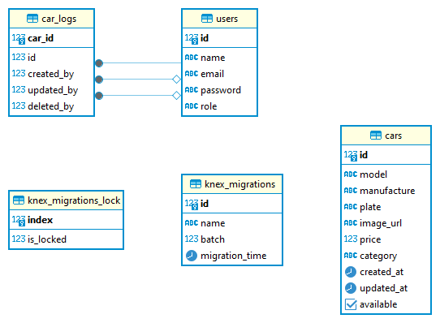

# Synrgy7 Challenge 6 OpenAPI - Daniel Hasiando Sinaga - FSW1

BCR - Car Rental

---
## Author


**Daniel Hasiando Sinaga - FSW1**
daniel.sinaga.ds@gmail.com


--- 
## OpenAPI Documentation

OpenAPI Endpoint: `/api-docs`

---
## Objective

- Terdapat endpoint untuk login sebagai
superadmin.
- Terdapat endpoint untuk menambahkan admin
yang mana hanya boleh dilakukan oleh
superadmin.
- Terdapat endpoint untuk registrasi sebagai
member.
- Terdapat 4 endpoint untuk melakukan CRUD
terhadap data mobil, dan hanya admin dan
superadmin saja yang dapat melakukan operasi
tersebut.
- Terdapat endpoint untuk melihat daftar mobil
yang tersedia.
- Terdapat endpoint untuk melihat current user
dari token yang dimiliki.
- Setiap data mobil mempunyai informasi berikut:
  1. Siapa yang membuat data tersebut
  2. Siapa yang menghapus data tersebut
  3. Siapa yang terakhir kali mengupdate data
tersebut
- Menggunakan Service Repository Pattern dalam
membangun project ini.
- Terdapat halaman yang menampilkan
dokumentasi API, baik itu menggunakan 
Swagger UI, Redoc atau Library lain di dalam
HTTP Server tersebut.
- Terdapat endpoint yang merespon dengan Open
API document dari REST API yang dibangun
dalam bentuk JSON.

---
## ERD



--- 

## Swagger (OpenaAPI)
.png)
.png)
.png)

--- 
## OpenAPI Documentation


Superadmin: `{email: superadmin@mail.com, password: password}`  
Admin: `{email: admin@mail.com, password: password}`  
User: `{email: user@mail.com, password: password}`

---

## Authentication

This API uses Bearer Authentication. Include the following header in your requests:

```
Authorization: Bearer <token>
```

---

## Tags

- **Cars**
- **Users**
- **Log**

---

## Endpoints

### Cars

#### Get Cars
- **Endpoint**: `/api/cars/`
- **Method**: `GET`
- **Security**: Bearer Authentication
- **Response**: `200 OK` - Successful response

#### Add Car (With Upload)
- **Endpoint**: `/api/cars/`
- **Method**: `POST`
- **Security**: Bearer Authentication
- **Request Body**:
  - Content-Type: `multipart/form-data`
  - Properties:
    - `model` (string): New Model
    - `manufacture` (string): New Manufacture
    - `plate` (string): New Plate
    - `price` (integer): 888
    - `category` (string): New Category
    - `image` (binary): Car image file
- **Response**: `201 Created` - Data successfully added
  - Headers:
    - X-Powered-By: Express
    - Content-Type: application/json; charset=utf-8
    - Content-Length: 308
    - ETag: W/"134-vtdKAv7AJtHWdmECmhnqwJNb18k"
    - Date: Sat, 18 May 2024 13:44:38 GMT
    - Connection: keep-alive
    - Keep-Alive: timeout=5
  - Example Response:
    ```json
    {
      "status": "Success",
      "message": "Data successfully added",
      "data": {
        "model": "New Model",
        "manufacture": "New Manufacture",
        "plate": "New Plate",
        "image_url": "/uploads/vbX_VMqJ5tiPijB8.jpg",
        "price": "888",
        "category": "New Category",
        "created_at": "2024-05-18T13:44:38.307Z",
        "updated_at": "2024-05-18T13:44:38.307Z",
        "id": 102
      }
    }
    ```

#### Edit Car By Id (With Upload)
- **Endpoint**: `/api/cars/1`
- **Method**: `PUT`
- **Security**: Bearer Authentication
- **Request Body**:
  - Content-Type: `multipart/form-data`
  - Properties:
    - `model` (string): Edit Model
    - `manufacture` (string): Edit Manufacture
    - `plate` (string): Edit Plate
    - `price` (integer): 69
    - `category` (string): Edit Category
    - `image` (binary): Car image file
    - `id` (integer): 1
- **Response**: `200 OK` - Data successfully updated
  - Headers:
    - X-Powered-By: Express
    - Content-Type: application/json; charset=utf-8
    - Content-Length: 311
    - ETag: W/"137-DSl6Zbz3Cs4WJNa33VHNj9dogIw"
    - Date: Sat, 18 May 2024 13:45:46 GMT
    - Connection: keep-alive
    - Keep-Alive: timeout=5
  - Example Response:
    ```json
    {
      "status": "Success",
      "message": "Data successfully updated",
      "data": [
        {
          "id": 1,
          "model": "Edit Model",
          "manufacture": "Edit Manufacture",
          "plate": "Edit Plate",
          "image_url": "/uploads/dfW25BV69SHl_qE3.jpg",
          "price": 69,
          "category": "Edit Category",
          "created_at": "2024-05-18T13:17:59.835Z",
          "updated_at": "2024-05-18T13:45:46.453Z"
        }
      ]
    }
    ```

#### Delete Car By Id
- **Endpoint**: `/api/cars/1`
- **Method**: `DELETE`
- **Security**: Bearer Authentication
- **Response**: `200 OK` - Data successfully deleted
  - Headers:
    - X-Powered-By: Express
    - Content-Type: application/json; charset=utf-8
    - Content-Length: 56
    - ETag: W/"38-Xv4o4XPmL6Ozwca9Lz54Zd/ffdM"
    - Date: Sat, 18 May 2024 13:46:13 GMT
    - Connection: keep-alive
    - Keep-Alive: timeout=5
  - Example Response:
    ```json
    {
      "status": "Success",
      "message": "Data successfully deleted"
    }
    ```

#### Get Available Cars
- **Endpoint**: `/api/cars/available`
- **Method**: `GET`
- **Security**: Bearer Authentication
- **Response**: `200 OK` - Successful response

---

### Users

#### Register
- **Endpoint**: `/api/users/register`
- **Method**: `POST`
- **Request Body**:
  - Content-Type: `application/json`
  - Example:
    ```json
    {
      "name": "New User 1",
      "password": "password",
      "email": "newuser1@mail.com"
    }
    ```
- **Response**: `200 OK` - Successful response

#### Register Admin
- **Endpoint**: `/api/users/register/admin`
- **Method**: `POST`
- **Security**: Bearer Authentication
- **Request Body**:
  - Content-Type: `application/json`
  - Example:
    ```json
    {
      "name": "New Admin 1",
      "password": "password",
      "email": "newadmin1@mail.com"
    }
    ```
- **Response**: `200 OK` - Successful response

#### Login User
- **Endpoint**: `/api/users/login/`
- **Method**: `POST`
- **Request Body**:
  - Content-Type: `application/json`
  - Example:
    ```json
    {
      "email": "user@mail.com",
      "password": "password"
    }
    ```
- **Response**: `200 OK` - Successful response

#### Login Super Admin
- **Endpoint**: `/api/users/login/admin`
- **Method**: `POST`
- **Request Body**:
  - Content-Type: `application/json`
  - Example:
    ```json
    {
      "email": "superadmin@mail.com",
      "password": "password"
    }
    ```
- **Response**: `200 OK` - Successful response

#### Get Current User
- **Endpoint**: `/api/users/me`
- **Method**: `GET`
- **Security**: Bearer Authentication
- **Response**: `200 OK` - Successful response

---

### Log

#### Get Car Log by Id
- **Endpoint**: `/api/log/1`
- **Method**: `GET`
- **Security**: Bearer Authentication
- **Response**: `200 OK` - Successful response

---

### Notes
- Ensure that the Bearer token is included in the header for endpoints that require authentication.
- The API responses include various headers for managing response details, such as content type, length, and connection status.

Feel free to reach out if you have any questions or need further assistance!
